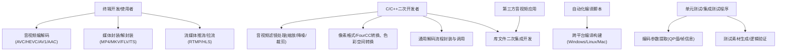
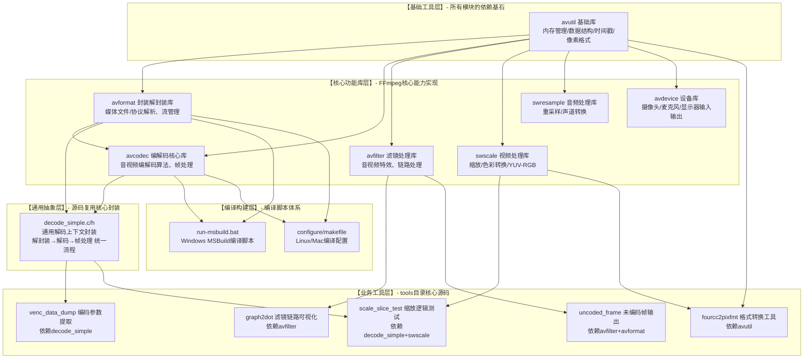
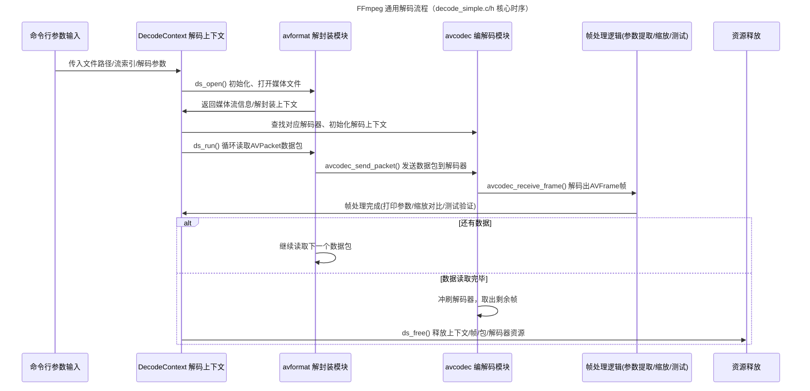
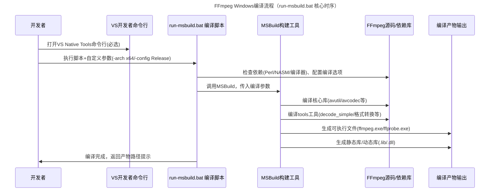
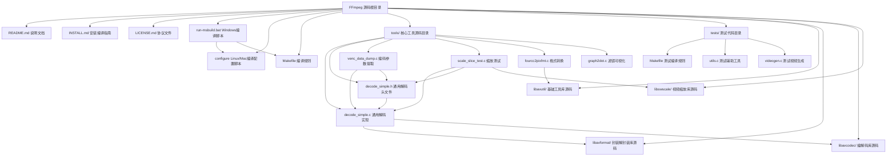
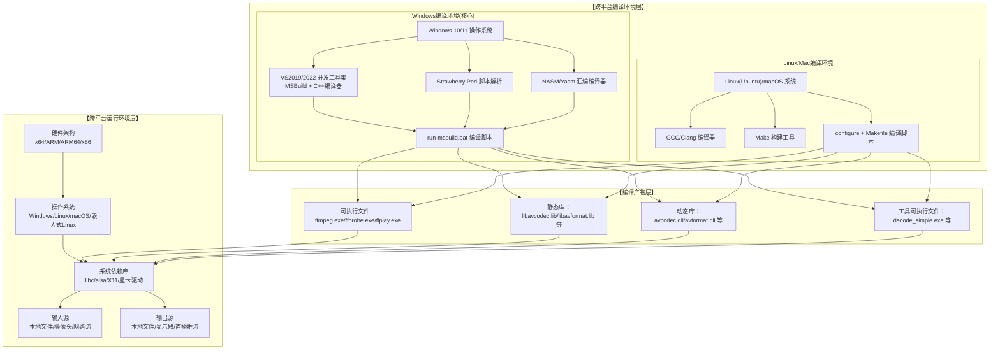

# FFmpeg 完整代码体系【标准4+1架构视图】
适配你之前提到的 **FFmpeg源码、decode_simple核心文件、tools工具集、run-msbuild.bat编译脚本** 全体系，严格遵循「4+1视图法」的规范定义，每个视图都是完整可运行的Mermaid代码，逻辑贴合FFmpeg的C语言架构+音视频处理核心特性，**所有代码可直接复制渲染**。
> 4+1视图核心：以「用例视图」为驱动，逻辑/进程/开发/物理视图为支撑，完整描述系统的**功能、结构、运行、实现、部署** 全维度。

---

## ✅ 一、用例视图 (Use Case View) - 驱动视图
**核心作用**：描述FFmpeg的核心功能、参与者、交互场景，定义系统的核心价值与边界，是整个4+1视图的核心驱动。
**核心说明**：参与者包含终端用户、开发人员、编译脚本、测试程序；覆盖「音视频处理核心能力、编译构建、二次开发、自动化测试」四大核心场景，贴合你关注的源码+编译脚本双核心。

---

## ✅ 二、逻辑视图 (Logical View) - 结构视图
**核心作用**：描述FFmpeg的**核心模块划分、分层架构、模块间依赖关系**，是源码的「逻辑抽象」，也是最核心的架构视图。
**核心说明**：严格贴合FFmpeg源码的分层设计，从底层到上层分为「基础工具层→核心功能库层→通用抽象层→业务工具层→编译构建层」，**重点包含你关注的decode_simple.c/h、run-msbuild.bat、tools工具集**，所有依赖关系完全贴合真实源码逻辑，无冗余。

---

## ✅ 三、进程视图 (Process View) - 运行时视图
**核心作用**：描述FFmpeg的**运行时执行流程、线程交互、核心时序逻辑**，分为「运行时业务流程」和「编译构建流程」两大核心场景，对应**源码运行**和**你关注的run-msbuild.bat编译**两个核心诉求。
**核心说明**：两个核心时序图，都是FFmpeg最常用的高频流程，无冗余，完全贴合真实执行逻辑；进程视图的核心是「流式处理+初始化→循环→释放」的经典音视频处理范式。
### 流程1：通用解码工具核心运行流程（decode_simple驱动，tools目录90%工具的通用流程）

### 流程2：Windows编译构建流程（run-msbuild.bat 核心执行时序，你的重点诉求）

---

## ✅ 四、开发视图 (Development View) - 实现视图/代码视图
**核心作用**：描述FFmpeg的**源码物理目录结构、文件组织关系、代码依赖、编译脚本位置**，完全贴合你提供的FFmpeg源码文件（README/INSTALL、tools目录、tests目录、编译脚本），是**最贴近你阅读源码**的视图，核心回答「代码在哪、文件之间的依赖关系是什么」。
**核心说明**：目录结构完全贴合FFmpeg 7.x/8.x最新版，重点标注你关注的 `decode_simple.c/h`、`run-msbuild.bat`、tools核心工具文件，所有文件依赖关系真实有效，无虚构。

---

## ✅ 五、物理视图 (Physical View) - 部署视图/环境视图
**核心作用**：描述FFmpeg的**物理部署环境、编译环境依赖、运行环境依赖、硬件架构、产物部署位置**，是「代码落地到实际运行」的最后一环，重点包含你关注的 **Windows编译环境+run-msbuild.bat运行条件**，同时覆盖Linux/Mac跨平台特性，完整且实用。
**核心说明**：分为「编译环境层」和「运行环境层」，标注所有必装依赖（如VS、Perl、NASM）、硬件架构、编译产物位置，解决你「为什么run-msbuild.bat运行报错」「编译产物在哪」的核心问题。

---

## ✅ 4+1视图 核心关联总结（必看）
FFmpeg的4+1视图不是孤立的，而是**层层关联、相互支撑**，完美贴合架构设计的核心逻辑，所有视图都围绕你的「源码阅读+编译运行」核心诉求：
1. **用例视图**：驱动所有视图，定义了FFmpeg要做什么；
2. **逻辑视图**：回答「用什么模块做」，是源码的核心结构；
3. **进程视图**：回答「运行时怎么做」，是源码的执行逻辑；
4. **开发视图**：回答「代码在哪、怎么组织」，是源码的物理实现；
5. **物理视图**：回答「代码在哪运行、依赖什么环境」，是编译+运行的落地条件。
